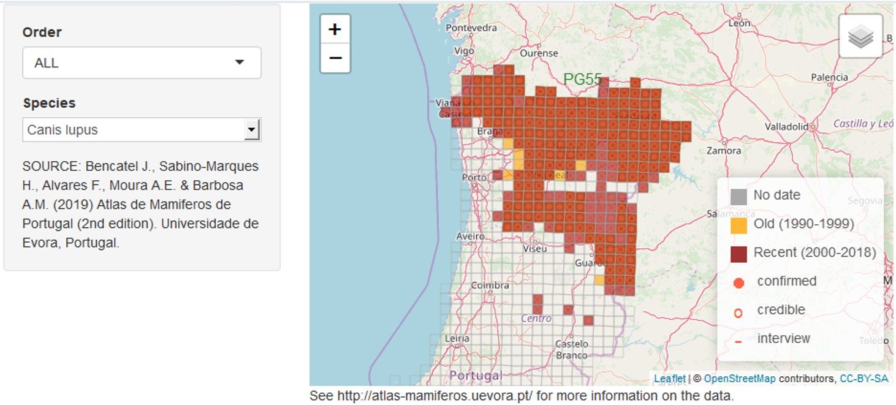

# Atlas of Mammals in Portugal

Shiny app showing interactive maps of the Portuguese mammal atlas (Bencatel et al. 2019). If you have R installed with the 'shiny' package and the app's dependencies (currently 'rgdal', 'sp' and 'leaflet'), you can **run the app in your computer** by typing:

```{r, eval=FALSE}
shiny::runGitHub("AtlasMamPor", "AMBarbosa")
```

You can also **use the app online** at [shinyapps.io](https://ambiogeo.shinyapps.io/atlasmampor/). You will be able to interactively create maps like this one on wolf distribution in Portugal:



If you use mammal occurrence data contained in these files, remember to **cite**:

**REFERENCES**

Bencatel J., Sabino-Marques H., Álvares F., Moura A.E. & Barbosa A.M. (2019) *Atlas de Mamíferos de Portugal*, 2ª edição. Universidade de Évora, Évora. URL: https://atlas-mamiferos.uevora.pt
