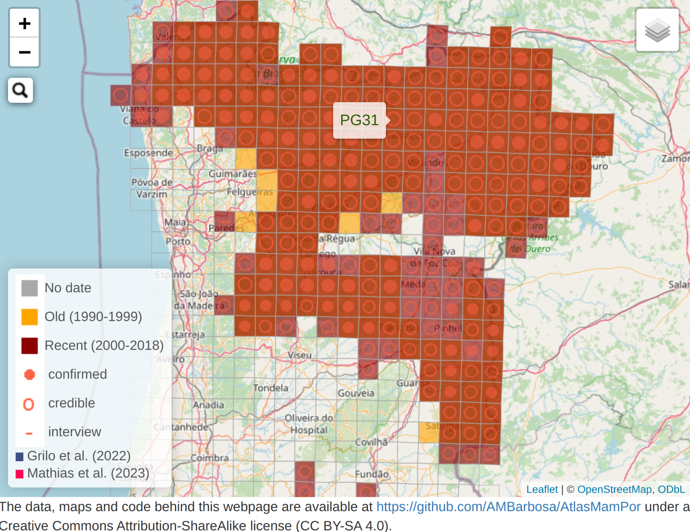

# Atlas of Mammals in Portugal

This repo contains the data and code behind the terrestrial interactive maps of the Portuguese mammal atlas ([Bencatel, Sabino-Marques, Álvares, Moura & Barbosa 2019](https://atlasmamiferosportugal.wordpress.com)). More recently, optional layers were added with other official mammal datasets published since ([Grilo et al. 2022]( https://doi.org/10.1002/ecy.3654); [Mathias et al. 2023](https://livrovermelhodosmamiferos.pt/)). If you have R installed with the 'shiny' package and the app's dependencies (currently 'terra', 'leaflet' and 'leaflet.extras'), you can **run the app in your computer** by typing:

```{r, eval=FALSE}
shiny::runGitHub("AtlasMamPor", "AMBarbosa")
```

You can also just [**use the app online**](https://ambiogeo.shinyapps.io/atlasmampor/) with a standard web browser. You'll be able to interactively create maps such as this one on wolf occurrence records in Portugal:

[](https://ambiogeo.shinyapps.io/atlasmampor)

These materials are available under a **Creative Commons Attribution-ShareAlike license (CC BY-SA 4.0)**. If you use species occurrence data contained in these files, remember to **cite**:

**REFERENCES**

Bencatel J., Sabino-Marques H., Álvares F., Moura A.E. & Barbosa A.M. (2019) *Atlas de Mamíferos de Portugal*, 2ª edição. Universidade de Évora, Évora. URL: https://atlasmamiferosportugal.wordpress.com

Grilo et al. (2022) Mammals in Portugal: A data set of terrestrial, volant, and marine mammal occurrences in Portugal. *Ecology*, 103: e3654. URL: https://doi.org/10.1002/ecy.3654

Mathias M.L. (coord.), Fonseca C., Rodrigues L., Grilo C., Lopes-Fernandes M., Palmeirim J.M., Santos-Reis M., Alves P.C., Cabral J.A., Ferreira M., Mira A., Eira C., Negrões N., Paupério J., Pita R., Rainho A., Rosalino L.M., Tapisso J.T. & Vingada J. (eds.) (2023) *Livro Vermelho dos Mamíferos de Portugal Continental*. FCiências.ID, ICNF, Lisboa. [Data downloaded from GBIF (ICNF Red Book of Mammals collections) and filtered to exclude records with spatial uncertainty larger than 10 km2]
